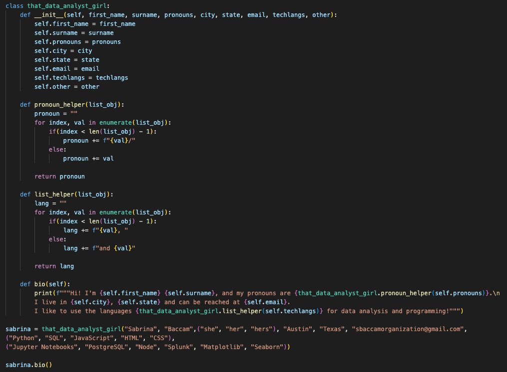

<picture></picture>
# <h1 align="center" style="margin-top: 0px;">You've found Sabrina's treasure <strike>cove</strike> of code!</h1>

 <picture></picture>
Thank you for landing on my markdown document. If you're taking the time to learn more about me, I am grateful.  
My journey is a wild one. I am a product of two immigrants essentially floating on a jellyfish to get to America. My studies led me to an Economics degree, a billion less hours of sleep than a normal person, and a penchant for changing up my MySpace and Tumblr profiles. Quickly after graduating, I became a technical recruiter and learned the world of programmers and developers. After and by no real mapped-out plan, I ended up being an Outcomes Coordinator at two coding bootcamps teaching budding software engineers industry and market knowledge, resume building, and generally how to navigate the tech space on their own. Although I had prior experience with regressional analyses, I ended up going through the program where I work to learn more about data analytics. Now, I'm using my skills with Python, SQL, and various libraries to manipulate, organize, and visualize data!
 Essentially, I used to <em>help hire</em> software engineers, then I <em>coached</em> software engineers, and now I am in the middle of my diabolical plan to [learn how to code like the next Ada Lovelace and] <em>take all of their jobs</em>. (Just kidding... for legal reasons.)
  That's the abridged story of how I got to the beginning of my coding journey! Thanks for taking the time to listen to my rambling.
  
<picture></picture>
 
## **A quick and pointless rundown of who I am**:

<table border="0">
 <tr>
 </tr>
 <tr>
    <td>
      <ul> 
<li>:thailand:	A first-generation Asian American woman</li> 
<li>:ox:	A graduate of The University of Texas at Austin</li> 
<li>:woman_teacher:	A technical-recruiter-turned-data-analyst</li>  
<li>:boom:	<strike>Pretty much</strike> the best minesweeper player you'll meet</li> 
<li>:dog2:	Best friends with a dog and frenemies with a cat</li>  
<li>:cat2:	Somehow still a cat person</li> 
<li>:computer:	Someone that somehow found her way into a coding bootcamp</li> 
      </ul>
   </td>
    <td>
      <ul>
<li>:libra:	:virgo:	:sagittarius:	A libra sun, virgo moon, sagittarius rising</li> 
<li>:broom:	Kind of a neat freak</li> 
<li>:corn:	Weirdly obsessed with corn (I hate popcorn though!)</li> 
<li>:fr:	Someone that minored in French but is still afraid to speak to actual French people</li>  
<li>:keyboard:	Keyboard builder</li> 
<li>:woman_farmer:	Indoor gardener</li> 
<li><em>... and much more!</em></li> 
</ul>
   </td>
 </tr>
</table>

Please feel more than free to look at my files. A lot are a work in progress or from me just messing around with learning materials.

<h3 align="center">:star2: Check out my portfolio <a href="https://unbirthdays.github.io/">here</a>! :dizzy:</h3>

